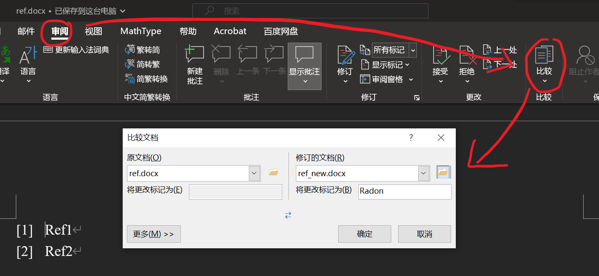

# WORD-REF-REARRANGE

根据交叉引用的出现顺序调整MS-Word中参考文献的顺序

## 使用方法

准备一个正文文件和一个只存储了参考文献内容的文件. 假设这里正文文件为`main.docx`, 参考文献文件为`ref.docx`.

**在使用前, 记得更新一下域, 以确保正文中的交叉引用不存在如未找到引用源这样的问题 :)**


然后, 输入以下命令, 对参考文献进行重新排序:

```
python ./rearrange.py -m main.docx -r ref.docx
```

重新排序后的参考文献将输出到`ref_new.docx`中, 可利用word的比较功能查看不同, 并调整参考文献的顺序:



